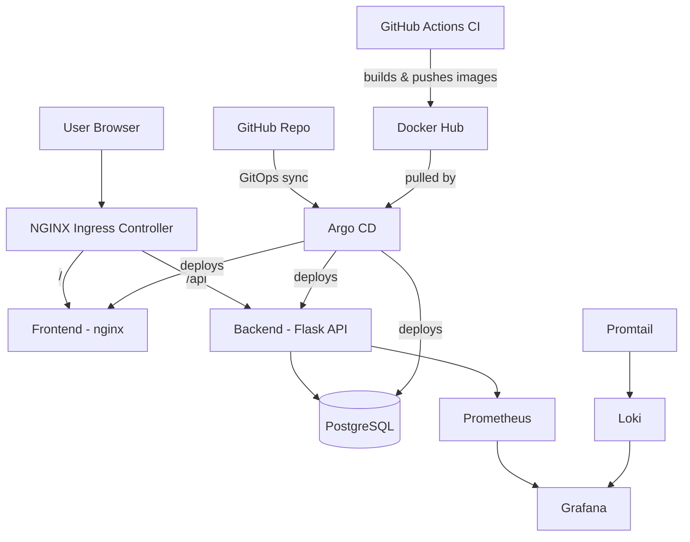

# Architecture

## System Overview

## Components

| Component | Technology | Purpose |
|---|---|---|
| Frontend | HTML/CSS/JS + nginx | Displays system health and monitored services |
| Backend | Python Flask | REST API serving service status and metrics |
| Database | PostgreSQL | Persistent storage for monitored services |
| Ingress | NGINX Ingress Controller | Routes external traffic by path |
| CI | GitHub Actions | Builds and pushes Docker images on every push |
| GitOps | Argo CD | Syncs cluster state to match Git automatically |
| Packaging | Helm | Templates and packages all Kubernetes manifests |
| Monitoring | Prometheus + Grafana | Metrics collection and visualization |
| Logging | Loki + Promtail | Centralized log aggregation |

## Data Flow

1. User requests hit the Ingress controller
2. Requests to `/` route to the frontend; requests to `/api/*` route to the backend
3. Backend reads/writes service data in PostgreSQL
4. Prometheus scrapes metrics from cluster and application components
5. Promtail ships container logs to Loki
6. Grafana visualizes both metrics (Prometheus) and logs (Loki)
7. Any change pushed to the Git repo is automatically detected and deployed by Argo CD